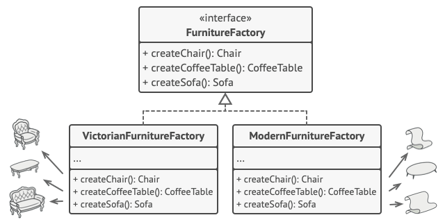

## Abstract Factory

##### 🚩  Intent  
Abstract Factory is a creational design pattern that lets you produce families of related objects without specifiying their concrete classes.

---

#### 😐 Problem
Imagin that you`re creating a funiture shop simulator. Your Code consists of classes that represent:
1. A family of related products, say: ``Chair`` + ``Sofa`` + ``CoffeeTable``.

2. Several variants of this family. For example, products ```Chair``` + ``Sofa`` + ``CoffeTable``  are available in these variants: ``Modern``, ``Victorian``, ``ArtDeco``.


You need a way to create individual furniture objects so that they match other objects of the same family. Customers get quite mad when they receive non-matching furniture.

Also, you don`t want to change existing code when adding new products or families of product to the program. Furniture vendors update their catalogs very often, and you would not want to change the core code each time it happens.

---

#### 😋 Solution

The first thing the Abstract Factory pattern suggest is to explicitly declare interfaces for each distinct product of the product family (e.g., chair, sofa or coffe table). Then you can make all variants of products follow those interfaces. For example, all chair variants can implement the ``Chair`` interface; all coffee table variants can implement the ``CoffeeTable`` interface, and so on.


The next move is to declare the Abstract Factory - an interface with a list of creation methods for all products that are part of the product family (for example, ``createChair``, ``createSofa``  and ``createCoffeeTable``). These methods must return abstract products types represented by the interfaces we extracted previously: ``Chair``, ``Sofa``, ``Coffeetable`` and so on.



Now, how about the product variants? For each variant of product family, we create a separate factory class based on the ``AbstractFactory`` inteface. A factory is a class that returns products of a particular kind. For example, the ``ModernFurnitureFactory`` can only create ``ModernChair``, ``ModernSofa`` and ``ModernCoffeeTable`` objects.

The Client code has to work wiht both factories and products via their respective abstract interfaces. This lets you change the type of a factory that you pass to the client code, as well as the product variant that the client code receives, without breaking the actual client code.

Say the client wants a factory to produce a chair. The client does not have to be aware of the factory`s class, nor does it matter what kind of chair it gets. Whether it`s Modern model or a Victorian-Style chair, the client must treat all chairs in the same manner, using the abstract ``Chair`` interface. With this approach, the only thing that the client knows about the chair is that it implements the ``sitOn`` mehtod in some way. Also, whichever variant of the chair is returned, it`ll always match the type of sofa or coffee table produced by the same factory object.

There`s one more thing left to clarify: if the client is only exposed to the abstract interfaces, what creates the actual factory objects? Usually, the application creates a concrete factory object at the initialization stage. Just before that, the app must select the factory type depending on the configuration or the environment settings.

--- 

####  🚀 Structure
