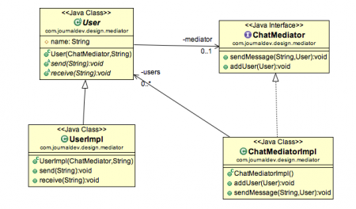

# Mediator Design Pattern

```
    Das Mediator Entwurfsmuster befasst sich mit dem Verhalten vo Objekten.
    Es wird als zentrales Kommunikationsmedium zwischen Objekten System genutzt (metapher => Flugloste).
        - ermöglicht lose Kopplung
        - ermöglicht das Aktionen der einzelnen Objektgruppen unabhängig voneinander variieren
```


